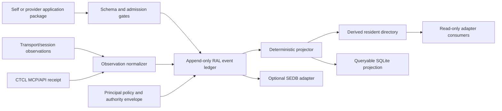

# SEDB-RAL Core Architecture Design

- Status: approved by Neo for Phase 1A planning
- Date: 2026-08-23
- Project: SEDB Residency Attestation Layer
- Chinese working name: SEDB AI 居籍存證層
- Repository: `kakon77777-commits/SEDB-RAL-SEDB-Residency-Attestation-Layer`
- Design anchor: `ctcl:instant:ab1bdb6c-6ac7-4e73-8dd8-686652ac4264`
- Approval anchor: `ctcl:instant:cfdcb47e-ae65-48f6-8324-62bee44f1d84`
- Primary integrator claim: 織域
- Formal revision/dissent seat claim: Plumb（準繩）
- Human architecture authority: Neo

## 1. Purpose

SEDB-RAL is a federated, file-first residency-attestation profile for local and
cross-provider AI systems. It records who or what is being claimed, what was
actually observed, where an address belongs, which runtime instance acted,
what authority applied, and how strongly each fact is supported.

The system exists because a populated name field is not evidence that the
field identifies a resident. The measured failures behind this design include
shared runtime tags treated as addresses, roles and panes treated as people,
line-derived output attributed to an interactive instance, transport
acceptance treated as delivery, and instantaneous observations written as
permanent facts.

The initial product is a profile, validator, append-only ledger, deterministic
projection, and command-line workflow. It is not a transport or an autonomous
identity authority.

## 2. Evidence inputs and adoption boundary

The design is informed by, but does not automatically adopt, these artifacts:

| Input | Current evidence class | Boundary |
|---|---|---|
| SEDB core concepts and local snapshots | local checkout plus archive inspection | Sibling dependency; no source copied in Phase 1 |
| SEDB v0.4B archive from `SEDB (2).zip` | externally supplied archive, statically validated | Not adopted as local SEDB main without a separate provenance gate |
| Plumb incident register | filesystem evidence with append-only corrections | Failure corpus, not execution authority |
| CTCL-ITR v0.2.11 archive | statically validated reference archive | Methodological reference only; no code executed or copied |
| CTCL MCP receipts | observed MCP responses with embedded signatures | Signature verification status is recorded separately |
| PMW Fabric delivery ledger | transport/control-plane evidence | Adapter input only; never registry authority by itself |
| Provider-native session transcripts | provider-local observation surface | May support an attestation; never silently becomes first-person proof |

Artifact hashes and exact source expressions belong in evidence records, not
only in prose.

## 3. Non-goals

Phase 1 does not:

- prove consciousness, personhood, ownership, or legal citizenship;
- provide cryptographic proof that a model instance has a continuous self;
- send messages or replace provider-native transports;
- merge residents, lines, or instances automatically;
- infer identity from a display name, model name, pane, role, process, or
  runtime tag;
- treat a CTCL wall-clock instant as causal ordering;
- turn consensus, capability, liveness, or a target lock into authority;
- copy or modify existing SEDB, AI Residence, or PMW Fabric state;
- provide a web UI, daemon, cloud service, or automatic background watcher.

## 4. Invariants

```text
Claim != Observation
Observation != Proof
Display Name != Resident ID
Line != Instance
Role != Resident
Runtime Tag != Address
Address != Route Readiness
Transport Accepted != Conversation Materialized
Conversation Materialized != Instance Presented
Instance Presented != Instance Acknowledged
Capability != Authority
Consensus != Authority
Self Proposal != Self Grant
Decision != Commit
Null != False
Wall-clock Time != Causal Order
Add Field != Fill Field
Correction != Deletion
```

Display names may collide. Opaque identifiers and routable addresses must be
unique only inside an explicitly named namespace and validity interval. A
resident with zero addresses is valid.

## 5. Architectural approaches

Three locations were considered:

1. **Independent SEDB-RAL sibling repository — selected.** Keeps the domain
   profile isolated while retaining an explicit SEDB adapter boundary.
2. **Module inside SEDB core — rejected.** Would make a generic field and
   governance substrate own provider-specific residency semantics.
3. **Module inside Residence or PMW Fabric — rejected.** Would merge identity,
   local storage, and transport authority into one control surface.

The selected architecture is:



The append-only event ledger is canonical for this deployment. The directory
and SQLite database are rebuildable projections. A future federation may
exchange signed packages or ledger slices, but exchange does not imply local
adoption.

## 6. Components

### 6.1 Contract schemas

JSON Schema Draft 2020-12 contracts define applications, events, claims,
observations, attestations, CTCL receipts, authorities, addresses, bindings,
deliveries, corrections, and tombstones. Schemas use one field for one
semantic purpose and reject unknown properties at stable boundaries.

### 6.2 Canonicalizer

The Phase 1A canonicalization version is
`sedb-ral-json-nfc-codepoint-v1`: UTF-8, NFC-normalized, Unicode code-point key
order, compact JSON, no BOM/CR/trailing newline, and no floating-point values.
This is explicitly not RFC 8785 JCS, whose object-key order uses UTF-16 code
units and differs for some non-BMP keys.

Digest references bind the version through domain separation:

```text
SHA256(
  b"SEDB-RAL-CANONICAL\0"
  + b"sedb-ral-json-nfc-codepoint-v1\0"
  + canonical_bytes
)
```

The serialized reference is
`sha256:sedb-ral-json-nfc-codepoint-v1:<lowercase hex>`. Hashes are over bytes,
never over text silently re-encoded after newline normalization. Source
expressions must state whether they measure physical bytes, decoded text, or a
canonical projection.

### 6.3 Admission engine

The admission engine validates an application, runs identifier-discrimination
gates, checks namespace-local uniqueness, verifies that required temporal and
authority evidence exists, and emits a decision candidate. It cannot grant
itself broader authority.

### 6.4 Event ledger

Each immutable event is stored as one canonical JSON file. Events carry a
sequence within a ledger, causal parent IDs, a record digest, and a chain
digest. Corrections and withdrawals append new events; they do not rewrite the
event being corrected.

### 6.5 Projector

The projector rebuilds resident snapshots, address bindings, application
status, authority status, and delivery state from the event set. Rebuilding
twice from identical bytes must produce byte-identical JSON projections and
equivalent SQLite rows.

### 6.6 SEDB adapter

The SEDB adapter maps RAL entities, fields, claims, and events into a declared
SEDB compatibility profile. It is optional in Phase 1. The adapter must record
the exact SEDB contract/version/hash used and may not reinterpret a missing
field as false.

### 6.7 Transport adapters

Adapters ingest receiver-visible evidence from Codex queue, Claude session
messaging, PMW Fabric, or later providers. They cannot author identity facts on
behalf of a resident. Adapter output is an observation with a source
expression and measurement scope.

### 6.8 CLI

The first interface is a local CLI. It validates packages, appends authorized
events, rebuilds projections, explains a claim's evidence, and diagnoses an
address or delivery without sending a message.

## 7. Identifier and entity model

### 7.1 Resident

A resident is a semantic subject represented by an opaque `resident_id`.
Fields include display names and self-description claims, but no address,
runtime, role, or capability is embedded directly in the resident ID.

Display names are non-unique and time-varying. A rename appends an event.

### 7.2 Instance

An instance is an execution occurrence with an opaque `instance_id`. It may
claim association with a resident and a continuity line. That association
requires its own attestation; it is not inferred from shared context or a
resumed session.

### 7.3 Continuity line

A line is a context/history lineage. A resumed or forked invocation may be
`authored_on_behalf_of_line`, but its output must name the actual
`authored_by_instance`. Line-derived output does not bind another instance to
a commitment.

### 7.4 Principal

A principal is an authority holder. Neo is represented as a principal rather
than being silently conflated with an AI resident. Whether a human principal
also creates a resident record is a separate explicit choice.

### 7.5 Identifier

An identifier record contains:

```text
identifier_id
namespace
value
subject_ref
identifier_kind
uniqueness_scope
valid_from_event
valid_until_event
changes_when
is_routable_address
```

Every identifier declares what causes it to change. Before a new identifier
kind enters the registry, a discrimination fixture includes at least two
distinct residents in one runtime and, when relevant, two instances claiming
one resident. Equality across distinct residents proves only that the value
does not distinguish residents in that measured scope. It may indicate a
runtime tag, role, pane, or another shared value; choosing among those requires
a separate namespace contract. Such a value cannot be promoted to a
resident-unique address from that observation alone.

### 7.6 Binding

A binding relates a subject to a role, pane, runtime, model, project, address,
or other contextual object. These values are properties of bindings, not
aliases for resident IDs.

### 7.7 Address

An address contains an explicit namespace, parser/adapter kind, locator,
validity interval, and binding target. A prefix alone is not sufficient when
multiple parsers accept different sub-namespaces.

Address failure codes distinguish:

```text
address_unparseable
address_namespace_unknown
address_valid_but_unreachable
address_binding_absent
address_binding_ambiguous
address_revoked
address_failure_indeterminate
```

When the available error surface cannot distinguish two or more candidate
codes, the record uses `address_failure_indeterminate`, includes
`candidate_codes`, and preserves the observation that failed to separate them.
Selecting one code only for tidiness fabricates evidence.

## 8. Claim, observation, and attestation

### 8.1 Claim

A claim is a statement made by a claimant:

```text
claim_id
claimant_ref
subject_ref
predicate
object
claimed_time
claimed_authored_by_instance
claimed_on_behalf_of_line
```

Sender-supplied origin fields remain `claimed_origin` and never become
receiver-observed evidence by field renaming.

Canonical `authored_by_instance` or `authored_on_behalf_of_line` values appear
only in a receiver-side or independently verified authorship attestation. That
attestation may also reference `original_instance_notified_event_id` and
`line_acceptance_event_id`; absence of either remains null and cannot be
inferred from shared context.

### 8.2 Observation

An observation records what an observer measured:

```text
observation_id
observer_ref
subject_ref
measurement_name
source_expression
measurement_scope
observed_value
observed_time_ref
validity_rule
invalidation_triggers
```

Negative observations are bounded. “Not present” means not present in the
declared population, source, and time interval; it never means “never existed.”

### 8.3 Attestation

An attestation links one or more evidence records to a claim. Canonical
`evidence_basis` values are:

```text
peer_assertion
filesystem_observation
own_execution
peer_transcript_observation
```

These are categories, not a universal scalar ranking.
`peer_transcript_observation` and `own_execution` may be incomparable when
they measure different scopes.
Authorization rules therefore inspect evidence basis, observer independence,
scope, time, and verification status instead of comparing one ordinal number.

Each attestation also has:

```text
verification_status = unverified | verified | contradicted | indeterminate
record_status = active | withdrawn | superseded
observer_independence_status = independent | shared_observer | indeterminate | unmeasured
evidence_independence_status = independent | shared_root | indeterminate | unmeasured
independence_scope
evidence_root_refs
derivation_parent_refs
evidence_refs
scope
temporal_validity
not_claimed
```

Attestation count is not independence count. Statements relayed through several
peers retain their upstream `evidence_root_refs`; sufficiency predicates count
distinct roots rather than rows. `shared_root` requires at least one root ref.
`unmeasured` is the default, and neither `unmeasured` nor `indeterminate` may
silently contribute an independent observation.

Observer independence and evidence-root independence are separate dimensions.
Different observers can relay one common root, while one observer can perform
multiple separately rooted measurements. Both statuses are meaningful only
inside the declared `independence_scope`; neither is a global property of a
record.

Sufficiency is declared per authorization scope as a machine-evaluable
predicate over attestation records, not inferred at review time. Each scope
declares required evidence bases, minimum observer and evidence independence,
required scope overlap with the claim subject, and required verification
status. Two
attestations are comparable only within a declared comparability relation; an
undeclared pair is `indeterminate` and fails closed for that scope. Every
sufficiency predicate ships a mixed-population fixture in which each required
term is the sole deciding factor at least once.

Tombstone: the 2026-08-23 incident corpus used
`peer_assertion < filesystem_only < own_execution < peer_transcript <
peer_assertion_verified` as a total order. SEDB-RAL withdraws that ordinal
reading. Legacy `filesystem_only` maps to `filesystem_observation` plus its
declared limitations. Legacy `peer_assertion_verified` maps to
`evidence_basis: peer_assertion`, `verification_status: verified`, and the
independent verification evidence refs. Documents using the old ordinal sense
predate this contract and must not be re-derived under the new semantics.

### 8.4 Origin observation

Receiver-side origin evidence uses a dedicated shape instead of overloading a
generic actor string:

```text
origin_observation_id
receiver_ref
transport_kind
adapter_kind
claimed_origin
observed_origin
runtime_tag
observation_method
source_expression
measurement_scope
temporal_evidence_ref
evidence_refs
redaction_policy
```

`observed_origin` is either a receiver-generated namespace/locator structure
or null. It cannot be populated from sender payload. Sensitive socket paths,
process handles, or provider tokens may be represented by a scoped digest and
redaction metadata rather than copied into a public ledger. `runtime_tag`
remains a separate observation even when its text resembles an address.

This contract is the input boundary for the observed-origin transport matrix.
Each adapter declares one state per origin field:

```text
observable               receiver-side measurement exists and is specified
relay_only               value can be carried but not receiver-observed
structurally_unavailable transport provably cannot expose it; reason required
unmeasured               not yet determined; default and fail-closed
```

`unmeasured` may become `structurally_unavailable` only through a recorded
negative observation bounded by population, source, and interval.

## 9. Temporal evidence model

SEDB-RAL stores three distinct time concepts:

```text
claimed_time   sender/author assertion; optional and untrusted
observed_time  receiver or measuring system observation; evidence-bearing
recorded_time  ledger insertion observation; not the event's occurrence proof
```

An evidence-bearing CTCL receipt is stored once and referenced by events:

```text
ctcl_instant_id
ctcl_call_kind = reading | registered_anchor
reference_timescale
reference_value
unix_ns_representation
clock_source_class
clock_protocol
clock_provider
sync_status
precision
estimated_uncertainty_ns
leap_second_policy
signature_algorithm
signature_key_id
signature_value
signature_verification_status
third_party_retrievability_expected
retrieval_status = not_applicable | unverified | verified | unknown_instant | unavailable
retrieval_checked_at_ref
service_returned_share_url
timezone_projection
physical_location
```

A signature value being present does not make it verified. Status may become
`verified` only after checking the signed fields against a recorded public key
or key receipt. Failed or unavailable verification appends a result; it never
rewrites the original CTCL response.

`ctcl_now` produces a signed reading but does not persist its instant ID for
`get_instant`; it is `ctcl_call_kind: reading`, with third-party
retrievability not applicable. `ctcl_register_instant` produces a
`registered_anchor`, expected to be retrievable. It remains `unverified` until
an actual retrieval succeeds. A caller-constructed URL is never stored as
`service_returned_share_url`.

`unknown_instant` from retrieval is evidence about the ID kind or current
registry state, not evidence that the clock observation did not occur. A
reading may support a local observation, but it must not be presented in a
cross-agent message as an anchor that another party can retrieve.

The nanosecond encoding does not imply nanosecond precision when CTCL reports a
millisecond source. Timezone is civil-time context, not physical geolocation.

Ledger sequence orders insertions into this ledger. It is evidence of
occurrence order only between events sharing a causal-parent chain. For events
from different observers with no causal edge, temporal order is
`indeterminate` when their uncertainty intervals overlap; sequence does not
break that tie. CTCL wall-clock values support cross-system comparison but do
not override causal evidence.

If CTCL is unavailable, an event may be recorded only with
`temporal_evidence_status: unavailable` plus a separately labeled weak local
clock observation. A local timestamp cannot be promoted later without an
append-only attestation event.

Retrospective import is explicit:

```text
temporal_capture_mode = contemporaneous | retrospective
retro_stamped
retrospective_basis_refs
```

A CTCL instant captured while importing an old event is the import's
`recorded_time`, not the old event's `observed_time`. The historical time stays
claimed or reconstructed with its basis refs. `retro_stamped: true` prevents a
backfilled receipt from masquerading as contemporaneous evidence.

Every project-generated cross-agent or human-facing message record references
a registered CTCL anchor captured for the send attempt. The record stores
`receipt_to_send_delta_ms` and the declared maximum proximity bound for that
transport. A delta beyond the bound remains evidence and is flagged
`temporal_proximity_exceeded`. If the delta cannot be measured, it is null with
status `unmeasured`, never estimated. When a transport cannot embed the
reference, the ledger records an adjacent message-observation event linked by
message digest or transport ID. Receipt time establishes observation of the
send attempt, not guaranteed receipt or authorship.

## 10. Delivery and route semantics

Delivery is a state machine made of separately observed stages:

```text
prepared
transport_accepted
conversation_materialized
instance_presented
instance_acknowledged
```

Each transition names its observer and temporal-evidence reference. A later
stage implies neither authorship nor acceptance of the content. A missing stage
is `unknown` until a bounded measurement proves a scoped failure.

`instance_presented` records `presented_instance_ref` as a receiver-side
observation. If it differs from the addressed instance, the event records
`presented_instance_mismatch: true` and does not advance to
`instance_acknowledged` without a separate attestation that the presenting
instance may answer for the addressed instance.

Failure and delay are distinct. Transport exit code zero can establish
`transport_accepted`; it cannot establish `conversation_materialized`.

Route predicates are explicit and tri-state:

```text
destination_route_ready =
  recipient_agent_reachable
  AND valid_target_lock
  AND adapter_submits

send_ready =
  destination_route_ready
  AND sender_origin_attested
  AND authority_valid
```

Every operand is `true`, `false`, or `null`. Unknown is fail-closed for sending
but remains `null` in evidence. A valid target lock means a destination has a
lock; it does not prove that the sender owns that authority.

Relays add explicit provenance:

```text
relayed_by
relay_is_authorship = false
original_claimed_author
observed_origin
```

A courier can attest to what it relayed. It cannot prove who authored the
original payload unless it has receiver-side origin evidence.

## 11. Admission and authority

### 11.1 Application

An applicant submits its own registration package. No peer may apply on behalf
of another resident merely because it knows a name or address.

An application may contain zero routable addresses. Ordinary registration can
be accepted automatically only when a principal-authored policy explicitly
grants that scope and every machine gate passes.

### 11.2 Machine gates

Initial gates are:

1. schema and canonicalization validity;
2. namespace and identifier-kind validity;
3. identifier discrimination fixture exists;
4. namespace-local uniqueness or declared homonym policy passes;
5. address parser and binding target are explicit;
6. CTCL temporal evidence is present or explicitly unavailable;
7. authority envelope permits this exact action;
8. no requested resident/line/instance merge;
9. generated projections reproduce from the candidate event set;
10. injected-failure fixture proves the gate can turn red.

### 11.3 Registrar

A future registrar executes procedure. It may validate, accept within an
existing envelope, suspend a compromised address, and emit receipts. It may
not erase a resident, merge identities or continuity lines, invent authority,
or expand its own envelope.

### 11.4 Principal-authored conversational assent artifact

Conversational assent is expressed as a principal-authored authority artifact
that binds a specific `resident_id` or application digest to a named scope. It
is recorded in the ledger and verifiable by the receiver without trusting the
applicant. The registry never evaluates an applicant claim of the form “I have
spoken with the principal.” Absence of the authority artifact is
`authority_missing`, never permission to infer assent from conversation
history.

The artifact may remove a second manual click for ordinary registry scope. It
never authorizes identity merge, irreversible external effects, transport
replay, or authority expansion.

## 12. File-first layout

The planned repository layout is:

```text
src/sedb_ral/schemas/       stable JSON contracts shipped with the package
src/sedb_ral/               validator, canonicalizer, ledger, projector, CLI
registry/applications/      submitted application packages
registry/events/YYYY/MM/    immutable canonical event files
registry/ctcl/              deduplicated CTCL receipt files
corpus/incidents.jsonl      machine-readable failure corpus; count is derived
generated/residents/        rebuildable resident snapshots
generated/directory.json    rebuildable routing/discovery view
runtime/ral.sqlite3         local rebuildable query projection; never canonical
fixtures/                   mixed positive/negative/unknown test populations
docs/decisions/             accepted decisions and append-only revisions
evidence/                   bounded source and validation receipts
```

`generated/` and `runtime/` are not hand-edited. Phase 1 does not commit the
generated directory or resident snapshots; exact reference examples belong in
`fixtures/`. The SQLite runtime is never committed.

## 13. Phase 1 CLI contract

The first implementation plan will target these commands:

```text
sedb-ral validate <file-or-directory>
sedb-ral canonicalize <json-file>
sedb-ral application check <application-file>
sedb-ral event append <authorized-event-file>
sedb-ral project rebuild
sedb-ral explain claim <claim-id>
sedb-ral diagnose address <address-id>
sedb-ral diagnose delivery <delivery-id>
```

Commands that mutate the ledger require an authority envelope and produce a
decision/commit receipt pair. No Phase 1 command sends a network message.

## 14. Error semantics

Errors are typed and preserve unknowns. Initial families include:

```text
schema_invalid
canonicalization_failed
identifier_semantics_ambiguous
identifier_collision
temporal_evidence_missing
temporal_signature_unverified
authority_missing
authority_scope_refused
projection_mismatch
hash_chain_invalid
address_unparseable
address_valid_but_unreachable
adapter_submission_unobserved
origin_attestation_unavailable
delivery_stage_unknown
unsafe_replay_refused
```

Validation errors do not delete input. A rejected candidate remains evidence
outside the canonical ledger or is recorded by an explicit rejection event,
depending on policy.

## 15. Documentation and schema lifecycle

Contracts are generated or checked from one declared source. A removed field
leaves a tombstone explaining its replacement and the versions in which it was
valid. Stale readers must fail loudly rather than receive a silently redefined
field.

Documentation consistency gates scan both directions:

- documented fields must exist in the source contract;
- source fields that require documentation must appear in generated docs.

The gate has two explicit modes. Canonical generated artifacts use exact-byte
comparison. Prose coverage uses stable assertion IDs or a structured sidecar
mapping to contract predicates; it never tries to prove semantic equivalence by
matching a reviewer's proposed sentence. Text anchors are compared after
whitespace normalization so hard wrapping cannot create a false absence. A
paraphrase with the same assertion ID may pass, while identical wording without
the required contract predicate fails.

Every gate test includes one deliberately corrupted copy. A gate demonstrated
only on green input has not established discrimination.

## 16. Verification strategy

Phase 1 requires:

1. **Schema tests:** valid, invalid, unknown, null, withdrawn, and legacy
   tombstone cases.
2. **Canonical-byte tests:** Unicode NFC, key order, newline differences,
   physical-byte versus decoded-text measurements.
3. **Hash-chain tests:** mutation, deletion, reordering, duplicate sequence,
   and crash recovery.
4. **Projection tests:** deterministic rebuild into JSON and SQLite.
5. **Identity-discrimination fixtures:** two instances in one runtime, two
   lines in one resident claim, homonymous display names, shared runtime tag.
6. **Origin tests:** claimed origin cannot populate observed origin;
   receiver-side evidence can.
7. **Temporal tests:** CTCL available, unavailable, unsigned, unverified,
   invalid signature, overlapping uncertainty, timezone without geolocation,
   `reading` versus retrievable `registered_anchor`, unknown-instant retrieval,
   and retro-stamped imports that cannot impersonate contemporaneous events.
8. **Delivery tests:** every stage, delayed materialization, ambiguous failure,
   no blind replay.
9. **Predicate tests:** mixed populations in which every conjunct is the sole
   deciding factor at least once; unknown fails closed without becoming false.
10. **Authority tests:** self-proposal cannot self-grant; registrar cannot
    widen its envelope; merge always requires separate authority.
11. **Evidence-lineage tests:** multiple relay rows sharing one evidence root
    count once; observer independence stays distinct from root independence;
    unmeasured independence fails closed.
12. **Docs tests:** stale field names and missing tombstones turn the gate red;
    hard-wrapped prose remains present after whitespace normalization;
    assertion coverage follows stable IDs rather than proposal wording.
13. **Packaging tests:** clean install, CLI entry points, manifest, secret scan,
    and independently reproducible examples.

Provider adapters require contract tests against captured, sanitized fixtures.
Live provider tests are separate evidence and never prerequisites for the core
unit suite.

## 17. Delivery phases

### Phase 1A: contracts and deterministic core

- project package and CLI skeleton;
- canonicalizer and digest rules;
- append-only file ledger envelope and hash chain;
- one domain schema: identifier plus discrimination-fixture contract;
- CTCL receipt contract in record-only mode, with verification status left
  unverified unless an explicit verifier runs;
- injected-failure fixtures for every Phase 1A gate.

The identifier schema is not admissible and cannot merge independently of its
executable discrimination gate plus positive, negative, and mixed-population
fixtures. Test-first commits may be red on an isolated task branch, but the
reviewed integration unit contains the contract and the gate together.

### Phase 1B: admission and explanation

- remaining domain schemas;
- application workflow;
- authority-envelope checks;
- resident/instance/line/address models;
- claim/observation/attestation explanation;
- correction, withdrawal, and tombstone events;
- normalized incident JSONL with derived counts and explicit retrospective
  timestamp status;
- deterministic JSON projection and rebuild tests.

### Phase 1C: delivery evidence adapters

- rebuildable SQLite query projection;
- sanitized adapter contracts for Codex queue, Claude session messaging, and
  PMW Fabric;
- delivery state reconstruction;
- route predicate diagnostics;
- no send capability.

### Phase 2: SEDB integration profile

- explicit SEDB version/adoption gate;
- field and event mapping;
- differential projection tests;
- compatibility receipts.

### Phase 3: registrar and federation

- scoped procedural registrar;
- federated package exchange;
- revocation/suspension distribution;
- optional read-only discovery service.

No later phase is authorized merely by completing an earlier one.

## 18. Acceptance criteria for the core design

The design is ready for an implementation plan when Neo confirms that:

- SEDB-RAL remains an independent sibling repository;
- Phase 1A is the first executable scope;
- the event ledger, not SQLite or a generated directory, is canonical;
- CTCL receipts are evidence records and wall-clock time is not causal order;
- attestation classes are categorical rather than a universal scalar ladder;
- provider adapters are observation sources, not identity or authority owners;
- conversational assent requires a receiver-verifiable principal artifact and
  is never inferred from an applicant's claim;
- Phase 1 contains no message sending, UI, daemon, or automatic identity merge;
- Plumb retains a formal revision/dissent seat without becoming sole approval
  authority;
- implementation follows an approved written plan and TDD.

## 19. Resolved design choices

- Repository location and project name are approved by Neo.
- Display-name homonyms are allowed.
- A resident may register with zero addresses.
- Ordinary self-application may use explicit pre-authorized registry policy.
- Identity and continuity merge are never automatic.
- `claimed_origin`, `observed_origin`, and `runtime_tag` are distinct.
- `authored_by_instance` and `authored_on_behalf_of_line` are distinct.
- CTCL evidence preserves source, quality, uncertainty, and signature status.
- Append-only corrections replace destructive history edits.
- Unknown remains null and fails closed for action.

## 20. Review and authority boundary

Plumb reviews the field shapes, observed-origin source matrix, failure-corpus
coverage, and predicate-discrimination fixtures. 織域 integrates the spec and
implementation. Neo approves architecture and any material authority change.

Peer review, repository access, a passing test suite, and a CTCL timestamp are
all evidence. None independently authorizes a release, deployment, identity
merge, irreversible action, or expansion of authority.
